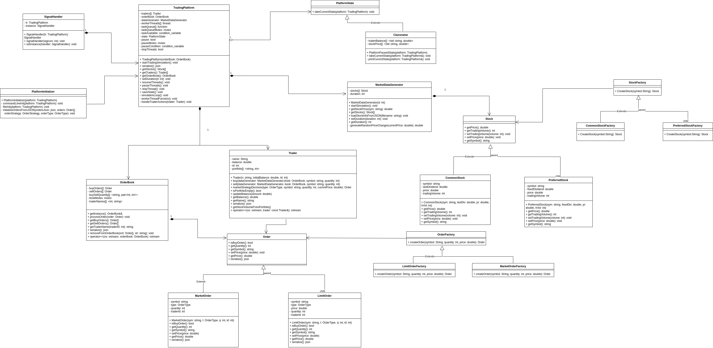
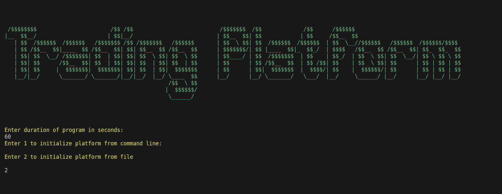
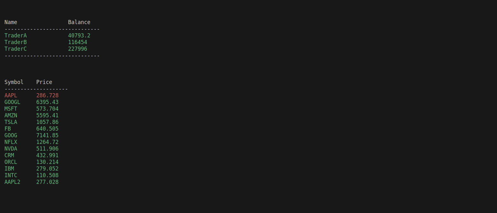
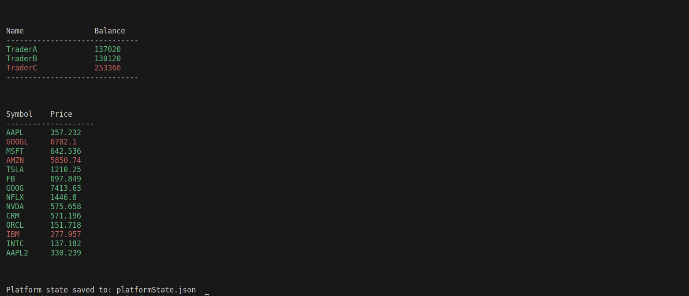

# Trading Platform 

## Table of Contents

1. [Overview](#overview)
2. [Project Structure](#project-structure)
3. [Dependencies](#dependencies)
4. [Usage](#usage)
    - [Command-Line Interface (CLI) Initialization](#command-line-interface-cli-initialization)
    - [File-Based Initialization](#file-based-initialization)
5. [Screenshots](#screenshots)
6. [Conclusion](#conclusion)
7. [License](#license)


## Overview

Trading platform designed to simulate a stock trading system. The trading platform allows multiple traders to buy and sell stocks while maintaining an order book and implementing multi-threading for concurrent trading activities.


## Project Structure

The project consists of several key components. Also you can see UML representation of program in Screenshots section:

- **TradingPlatform**: The main application class responsible for managing traders, the order book, market data generation, and multi-threading.

- **Traders**: Traders are entities that can buy and sell stocks. They are represented by the `Trader` class.

- **Stocks**: Stocks represent tradable assets. Two types of stocks are supported: `CommonStock` and `PreferredStock`.

- **Orders**: Orders are used to buy or sell stocks. Two types of orders are supported: `MarketOrder` and `LimitOrder`.

- **Factories**: Factories are responsible for creating instances of stocks and orders. `CommonStockFactory`, `PreferredStockFactory`, `MarketOrderFactory`, and `LimitOrderFactory` are used for this purpose.

- **OrderBook**: The order book maintains a list of buy and sell orders.

- **MarketDataGenerator**: This component simulates market data by generating random stock price changes over time.

- **PlatformState**: Platform states are used to capture and manage the state of the trading platform.

- **PlatformInitializer**: The initializer class facilitates the setup of the trading platform, including order creation and configuration.

- **SignalHandler**: The signal handler manages signals and responses in the context of the trading platform.


## Dependencies

To build and run the trading platform, you need the following:

1. C++ compiler supporting C++11 or later
2. Standard Library (STL)
3. CMake (minimum version 3.0)
4. [nlohmann/json](https://github.com/nlohmann/json): A JSON library for C++ used to read JSON files for configuration and data initialization.

If CMake is not installed, you can install it by following the instructions for your specific operating system:

- Ubuntu/Debian: 
    ```shell
    sudo apt-get install cmake
    ```
- Fedora:
    ```shell
    sudo dnf install cmake
    ```
- macOS (Homebrew): 
    ```shell
    brew install cmake
    ```
- Windows:
You can download the CMake installer from the official website: [CMake installer](https://cmake.org/download/)


## Usage

To use the trading platform, follow these steps:

1. Clone the repository to your local machine.
    ```shell
    git clone https://github.com/Kalashyan-1/Trading-Platform.git 
    ```
2. Open a terminal and navigate to the program directory.
3. Create a build directory: 
    ```shell
    mkdir build
    cd build
    ```
4. Generate the build files using CMake:
    ```shell
    cmake ..
    ```
5. Build the program using the appropriate build system. For example, on Unix-like systems, use make:
    ```shell
    make
    ```
6. Run the program by executing the executable:
    ```shell
    ./TradingPlatform
    ```


### Command-Line Interface (CLI) Initialization

The platform allows you to interactively provide initial orders and configurations through the command line. The CLI initialization process guides you through setting up the platform.


### File-Based Initialization

Alternatively, you can load initial orders and configurations from a JSON file. The platform uses this file to initialize traders, stocks, and orders.


## Screenshots













## Conclusion

This trading platform provides a comprehensive simulation of a stock trading system, offering flexibility in initialization and adherence to OOD and design patterns. It serves as a valuable tool for studying and experimenting with stock trading strategies, , as well as gaining hands-on experience with multi-threading in a real-world context.


## License

This trading platform is provided under the [MIT License](LICENSE). You are free to use and modify it as needed.

